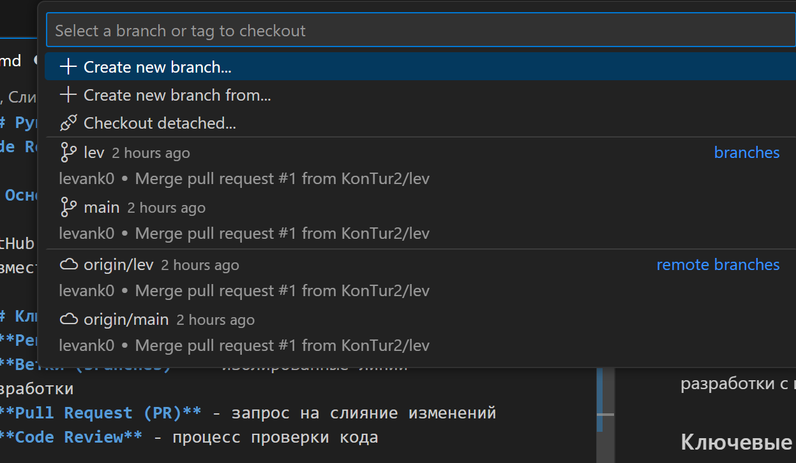

# Руководство по работе с GitHub: Ветки, Слияния и Code Review

## Основные понятия GitHub

GitHub - платформа для хостинга IT-проектов и совместной разработки с использованием Git.

### Ключевые элементы:
- **Репозиторий** - хранилище проекта
- **Ветки (branches)** - изолированные линии разработки
- **Pull Request (PR)** - запрос на слияние изменений
- **Code Review** - процесс проверки кода

## 1. Работа с ветками

создание новой ветки

### Наименование веток:

feature/ - для новой функциональности (пример: feature/user-auth)

fix/ - для исправлений багов

hotfix/ - для срочных исправлений

docs/ - для обновления документации

## 2. Процесс слияния (Merge) через Pull Request

### На GitHub:

Перейдите во вкладку "Pull requests"

Нажмите "New pull request"

Выберите:

    Base: feature (ветка, В которую мержим)

    Compare: lev (ваша ветка)

### Заполните информацию:

Название: "Feat: Добавить новую функциональность"

Описание: Детали изменений, скриншоты если нужно

Назначьте ревьюверов (Reviewers)

Свяжите с задачей (через #номер_issue)